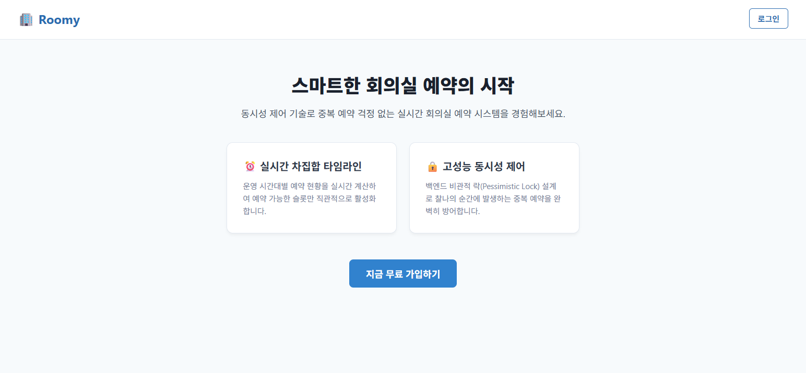
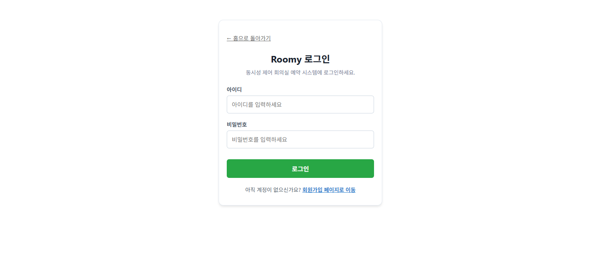

# Roomy 프론트엔드 개발 중간 보고서

## 1. 요약 (Summary)

- Roomy 프로젝트의 프론트엔드 파트는 React 기반으로 설계되었으며, 백엔드 API와의 안정적인 통신을 위해 `axios`를 활용한 전역 인터셉터 인프라를 구축했습니다.

- 사용자 인증(회원가입, 로그인) 및 회의실 대시보드 UI를 구현하였으며, 사용자 경험을 위해 페이지 간 라우팅 및 세션 검증 로직을 포함하였습니다.

- API 명세서를 준수하여 백엔드와 일관된 데이터 교환 구조를 완성했습니다.

## 2. 개발 결과 (Results)

- **통신 인프라:** `axiosInstance.js`를 통해 세션 유지(`withCredentials: true`) 및 글로벌 에러 핸들링 구현.
- **페이지 구현:**
  - `LoginPage.jsx`: 사용자 인증을 위한 로그인 폼 및 세션 검증 로직 구현.
  - `SignupPage.jsx`: 유효성 검사 로직(정규식 활용)이 포함된 회원가입 폼 구현.
  - `DashboardPage.jsx`: 회의실 목록 조회, 타임슬롯 가용성 확인, 예약 신청 및 취소 기능을 포함한 핵심 대시보드 구현.
- **동기화 및 리팩토링:** API 명세와 프론트엔드 엔드포인트 불일치 해결 및 경로 참조 에러(import path) 수정 완료.

## 3. 구현 화면 (Screenshots)

---

_작성일: 2026-05-27_
