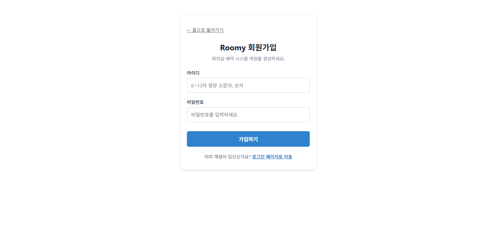

# Roomy — 스터디룸 예약 시스템 중간 보고서

---

## 요약

**프로젝트명:** Roomy — 동시성 제어 스터디룸 예약 시스템  
**개발 기간:** 2026.05.21 ~ 2026.05.29  
**팀 구성:** 2인 (백엔드: 김나현 / 프론트엔드: 김호성)  
**목적:** 동시에 같은 시간대로 예약 요청이 몰릴 경우 단 1건만 성공하도록 비관적 락(Pessimistic Lock)으로 데이터 무결성을 보장하는 예약 시스템 구현

**기술 스택**

| 구분 | 사용 기술 |
|------|-----------|
| Backend | Java 17, Spring Boot 3.5, Gradle, Spring Data JPA |
| Database | Oracle XE (Docker) |
| 인증 | Spring Security, 서버 세션 (JSESSIONID) |
| Frontend | React 19, Vite, Axios |

---

## 본론

---

### 1. 요구사항 정의

#### 1.1 기능 요구사항

**사용자**

| 번호 | 요구사항 | 비고 |
|------|----------|------|
| U-01 | 사용자는 아이디(6~20자)와 비밀번호(9~15자)로 회원가입할 수 있다 | 아이디 중복 불가 |
| U-02 | 사용자는 아이디/비밀번호로 로그인할 수 있다 | 성공 시 JSESSIONID 쿠키 발급 |
| U-03 | 사용자는 로그아웃할 수 있다 | 세션 삭제 |
| U-04 | 로그인한 사용자는 자신의 정보를 조회할 수 있다 | |

**회의실**

| 번호 | 요구사항 | 비고 |
|------|----------|------|
| R-01 | 회의실을 등록할 수 있다 (이름, 수용 인원) | |
| R-02 | 전체 회의실 목록을 조회할 수 있다 | |
| R-03 | 회의실 단건 정보를 조회할 수 있다 | |

**예약**

| 번호 | 요구사항 | 비고 |
|------|----------|------|
| E-01 | 로그인한 사용자는 회의실을 예약할 수 있다 | 날짜, 시작/종료 시간 지정 |
| E-02 | 동일 회의실·날짜·시작 시간의 중복 예약은 불가하다 | DB 복합 유니크 제약 |
| E-03 | 사용자는 자신의 예약 목록을 조회할 수 있다 | |
| E-04 | 사용자는 자신의 예약만 취소할 수 있다 | Soft Delete (상태: CANCELED) |
| E-05 | 날짜와 회의실 조건으로 예약 현황을 조회할 수 있다 | 로그인 불필요 |

#### 1.2 비기능 요구사항

| 항목 | 내용 |
|------|------|
| 인증 방식 | 서버 세션 기반 인증 (쿠키: JSESSIONID, 만료: 30분) |
| 동시성 제어 | 비관적 락(PESSIMISTIC_WRITE)으로 중복 예약 원천 차단 |
| 데이터 무결성 | DB 복합 유니크 제약 + 애플리케이션 레벨 중복 검증 이중 방어 |
| 보안 | BCrypt 패스워드 암호화 저장 |

---

### 2. API 명세

**Base URL:** `http://localhost:8080`  
**인증 방식:** 로그인 성공 시 서버에서 `JSESSIONID` 세션 쿠키 발급. 이후 인증 필요 API는 쿠키 자동 첨부.

#### 2.1 사용자 API

| Method | URL | 설명 | 인증 필요 |
|--------|-----|------|-----------|
| POST | /api/users/signup | 회원가입 | X |
| POST | /api/users/login | 로그인 | X |
| POST | /api/users/logout | 로그아웃 | X |
| GET | /api/users/me | 내 정보 조회 | O |

**POST /api/users/signup**
```json
// Request
{ "username": "testuser", "password": "password123" }

// Response 201 Created
{ "id": 1, "username": "testuser" }
```

**POST /api/users/login**
```json
// Request
{ "username": "testuser", "password": "password123" }

// Response 200 OK  (+ Set-Cookie: JSESSIONID=... 헤더 포함)
{ "id": 1, "username": "testuser" }
```

#### 2.2 회의실 API

| Method | URL | 설명 | 인증 필요 |
|--------|-----|------|-----------|
| POST | /api/rooms | 회의실 등록 | X |
| GET | /api/rooms | 전체 목록 조회 | X |
| GET | /api/rooms/{id} | 단건 조회 | X |

**POST /api/rooms**
```json
// Request
{ "name": "1번 회의실", "capacity": 10 }

// Response 201 Created
{ "id": 1, "name": "1번 회의실", "capacity": 10 }
```

#### 2.3 예약 API

| Method | URL | 설명 | 인증 필요 |
|--------|-----|------|-----------|
| POST | /api/reservations | 예약 생성 | O |
| GET | /api/reservations/my | 내 예약 목록 | O |
| DELETE | /api/reservations/{id} | 예약 취소 | O |
| GET | /api/reservations?roomId=&date= | 날짜별 예약 조회 | X |

**POST /api/reservations**
```json
// Request  (날짜: yyyy-MM-dd, 시간: HH:mm)
{
  "roomId": 1,
  "reservationDate": "2026-06-01",
  "startTime": "09:00",
  "endTime": "10:00"
}

// Response 201 Created
{
  "id": 1,
  "username": "testuser",
  "roomName": "1번 회의실",
  "reservationDate": "2026-06-01",
  "startTime": "09:00",
  "endTime": "10:00",
  "status": "RESERVED"
}
```

**DELETE /api/reservations/{id}**
- 타인의 예약 취소 시도 시 `403 Forbidden` 반환
- 물리적 삭제 없이 `status → CANCELED` (Soft Delete)

#### 2.4 공통 에러 응답

```json
{ "status": 401, "message": "로그인이 필요합니다." }
```

| 상태코드 | 상황 |
|----------|------|
| 400 | 입력값 검증 실패 |
| 401 | 미로그인 접근 또는 비밀번호 오류 |
| 403 | 권한 없음 (타인 예약 취소 시도) |
| 404 | 리소스 없음 (사용자, 회의실, 예약) |
| 409 | 중복 (아이디 중복, 예약 시간 중복) |

---

### 3. 프론트엔드

#### 3.1 개발 결과

- **통신 인프라:** `axiosInstance.js`를 통해 세션 유지(`withCredentials: true`) 및 전역 에러 핸들링 구현
- **페이지 구현:**
  - `LoginPage.jsx`: 로그인 폼 및 세션 검증 로직
  - `SignupPage.jsx`: 정규식 기반 유효성 검사가 포함된 회원가입 폼
  - `DashboardPage.jsx`: 회의실 목록 조회, 타임슬롯 가용성 확인, 예약 신청 및 취소 기능
- **동기화:** API 명세와 프론트엔드 엔드포인트 불일치 해결 및 import 경로 오류 수정 완료

#### 3.2 구현 화면

**홈페이지**


**로그인**


**회원가입**



---

### 4. 백엔드

#### 4.1 기술 스택

| 항목 | 내용 |
|------|------|
| 언어 / 프레임워크 | Java 17 / Spring Boot 3.5 |
| 빌드 | Gradle |
| ORM | Spring Data JPA (Hibernate) |
| DB | Oracle XE (Docker) |
| 인증 | Spring Security + HttpSession |
| 유틸 | Lombok, Spring Validation |

#### 4.2 아키텍처

레이어드 아키텍처로 구성하여 각 계층의 책임을 분리했다.

```
Client
  └─ Controller  (요청 수신, 응답 반환)
       └─ Service  (비즈니스 로직, 트랜잭션)
            └─ Repository  (DB 접근)
                 └─ Entity  (도메인 모델)

공통: GlobalExceptionHandler (@RestControllerAdvice)
```

**핵심 엔티티 관계**

```
User ──< Reservation >── MeetingRoom
```

- `Reservation`: `(room_id, reservation_date, start_time)` 복합 유니크 제약 적용
- `ReservationStatus`: `RESERVED` / `CANCELED` (Enum)

#### 4.3 현재 진행 상황

| 항목 | 상태 |
|------|------|
| 프로젝트 초기 세팅 (Spring Boot + Oracle XE 연동) | 완료 |
| 엔티티 설계 및 구현 (User, MeetingRoom, Reservation) | 완료 |
| Oracle Sequence 기반 PK 전략 적용 | 완료 |
| DB 복합 유니크 제약 선언 | 완료 |
| Repository 전체 구현 | 완료 |
| 전역 예외 처리 인프라 (CustomException, ErrorCode, GlobalExceptionHandler) | 완료 |
| 회원가입 API — POST /api/users/signup (입력값 검증 포함) | 완료 |
| 로그인 API — Service 로직 구현 | 완료 |
| 로그인 API — Controller 세션 처리 (POST /api/users/login) | 완료 |
| 로그아웃 API — POST /api/users/logout | 완료 |
| 스터디룸 초기 데이터 삽입 (MeetingRoomInitializer) | 완료 |

#### 4.4 추후 진행 예정

| 예정 항목 | 내용 |
|-----------|------|
| 내 정보 조회 | GET /api/users/me — findById Service 메서드 및 Controller 세션 인증 헬퍼 구현 |
| 회의실 API | POST /api/rooms, GET /api/rooms, GET /api/rooms/{id} |
| 예약 API 전체 | 예약 생성·취소·조회 서비스 및 컨트롤러 구현 |
| 비관적 락 적용 | `@Lock(PESSIMISTIC_WRITE)` 선언, Oracle `SELECT FOR UPDATE` 동작 확인 |
| 동시성 통합 테스트 | ExecutorService + CountDownLatch로 100 스레드 동시 예약 시도 → 1건 성공, 99건 실패 검증 |
| 예외 세분화 | DataIntegrityViolationException, 락 타임아웃 예외 별도 처리 |

---

_작성일: 2026-05-27_
